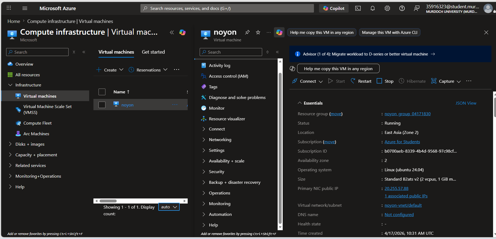
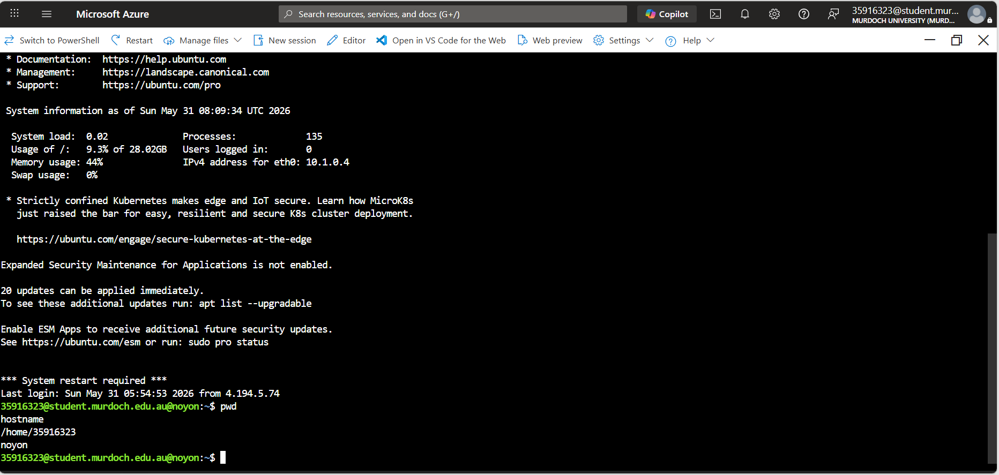
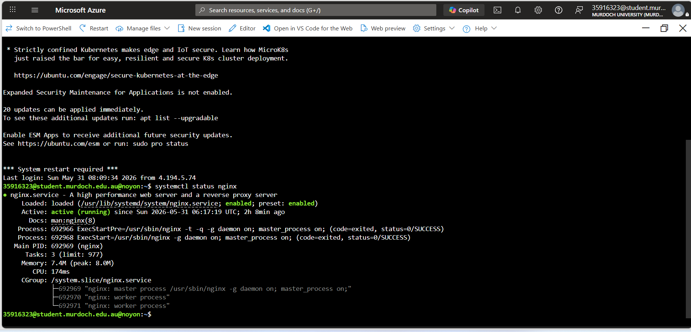
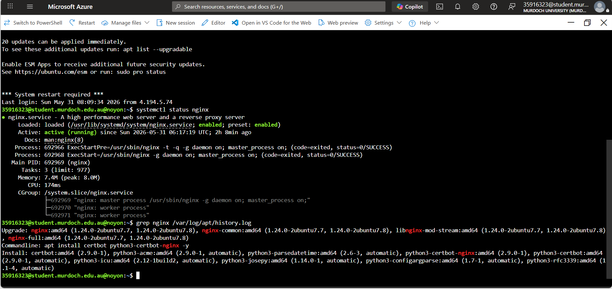
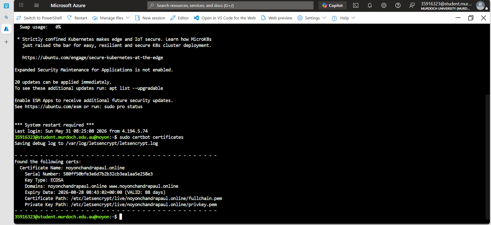
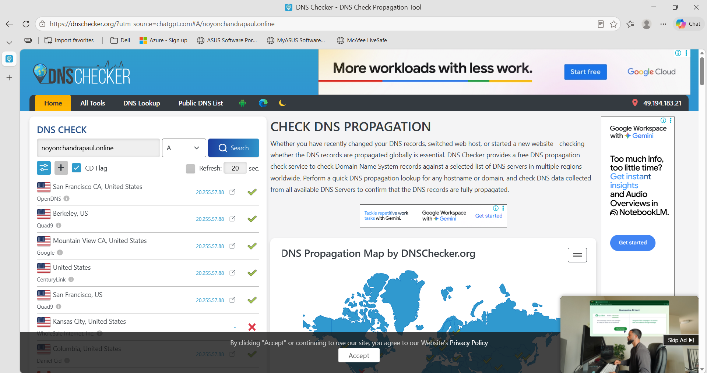

# ICT171 Cloud Server Project

## Student Information

| Item | Details |
|--------|--------|
| Name | Noyon Chandra Paul |
| Student ID | 35916323 |
| Unit | ICT171 Cloud Server Project |
| University | Murdoch University |
| Cloud Provider | Microsoft Azure |
| Operating System | Ubuntu Server 24.04 LTS |
| Web Server | Nginx |

---

# Project Overview

This project demonstrates the deployment and management of a cloud-hosted web server using Microsoft Azure Infrastructure as a Service (IaaS).

The objective was to create a Linux virtual machine, configure a web server, deploy a personal portfolio website, connect a custom domain name, and secure the website using SSL/TLS encryption.

The completed website is publicly accessible and hosted on an Azure Virtual Machine.

---

# Live Website

🔗 Website


https://noyonchandrapaul.online


---
## Video Explainer

🎥 YouTube Video:

https://youtu.be/p8naOS45dGY 

---
# GitHub Repository

🔗 Repository:

https://github.com/noyanpaul56-maker/ICT171-Cloud-Server-Project

---

# Cloud Platform Selection

Microsoft Azure was selected as the cloud provider for this project.

Reasons for selection:

- Access through Azure for Students subscription
- Industry-standard cloud platform
- Reliable Infrastructure as a Service (IaaS)
- Easy deployment and management of Linux virtual machines
- Practical experience with enterprise cloud technologies

---

# Server Configuration

| Component | Configuration |
|------------|---------------|
| Cloud Provider | Microsoft Azure |
| Virtual Machine | Azure VM |
| Operating System | Ubuntu Server 24.04 LTS |
| Web Server | Nginx |
| Domain Name | noyonchandrapaul.online |
| SSL Certificate | Let's Encrypt |
| Access Method | SSH |

---

# Project Implementation

## Step 1 – Azure Virtual Machine Creation

An Ubuntu Linux virtual machine was created in Microsoft Azure.

Features configured:

- Public IP Address
- Virtual Network
- Resource Group
- SSH Access
- Ubuntu Server 24.04

### Evidence



---

## Step 2 – SSH Connection

The virtual machine was accessed securely using SSH through Azure Cloud Shell.

Commands used:

```bash
hostname
pwd
```

### Evidence



---

## Step 3 – Nginx Installation

Nginx was installed on the Ubuntu server and configured as the web server hosting the portfolio website.

Commands used:

```bash
sudo apt update
sudo apt install nginx
```

### Evidence



---

## Step 4 – Verification of Nginx Installation

The installation history and active service status were verified.

Command used:

```bash
grep nginx /var/log/apt/history.log
```

### Evidence



---

## Step 5 – Website Deployment

A personal portfolio website was created using HTML and CSS and deployed to the Nginx web root directory.

Directory used:

```bash
/var/www/html
```

### Evidence



---

## Step 6 – Domain Name Configuration

A custom domain name was purchased and configured to point to the Azure Virtual Machine public IP address.

Domain:

```text
noyonchandrapaul.online
```

DNS records were updated to direct traffic to the server.

---

## Step 7 – DNS Verification

DNS propagation was verified using DNSChecker.

This confirmed that the domain correctly resolved to the Azure server's public IP address.

### Evidence



---

## Step 8 – SSL Certificate Configuration

Let's Encrypt SSL certificates were installed using Certbot.

Command used:

```bash
sudo certbot certificates
```

The website was secured using HTTPS encryption.

### Evidence


---

# Website Features

The deployed website contains:

- Personal profile section
- Education information
- Skills section
- Projects section
- Contact information
- Responsive navigation menu
- HTTPS secure connection

### Evidence


---

# Security Measures Implemented

The following security controls were implemented:

- SSH secure remote access
- Linux user authentication
- HTTPS encryption
- SSL/TLS certificates
- Nginx web server security
- DNS validation
- Cloud infrastructure security through Azure

---

# Networking Components

The deployment includes:

- Azure Virtual Network
- Public IP Address
- Domain Name System (DNS)
- HTTPS Encryption
- Internet Gateway Access

---

# Skills Demonstrated

This project demonstrates practical knowledge of:

- Cloud Computing
- Infrastructure as a Service (IaaS)
- Microsoft Azure
- Linux Administration
- SSH Remote Access
- Nginx Web Server Configuration
- DNS Management
- SSL/TLS Configuration
- Website Hosting
- GitHub Version Control

---

# Conclusion

This project successfully demonstrates the deployment of a secure cloud-hosted website using Microsoft Azure.

The implementation involved creating and managing an Ubuntu virtual machine, configuring an Nginx web server, connecting a custom domain name, implementing HTTPS security through SSL certificates, and deploying a functional portfolio website.

The project provided practical experience in cloud infrastructure management, Linux administration, web server configuration, networking, and cybersecurity principles.

---

# References

Microsoft Azure Documentation:
https://learn.microsoft.com/azure

Ubuntu Documentation:
https://help.ubuntu.com

Nginx Documentation:
https://nginx.org/en/docs

Let's Encrypt:
https://letsencrypt.org

DNS Checker:
https://dnschecker.org

GitHub:
https://github.com
